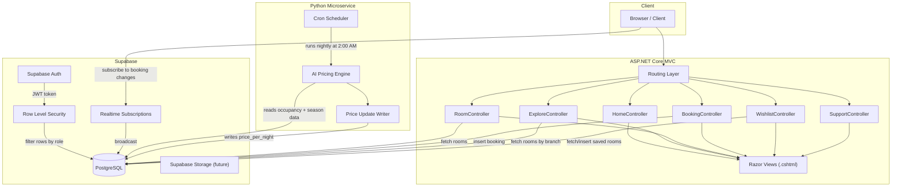
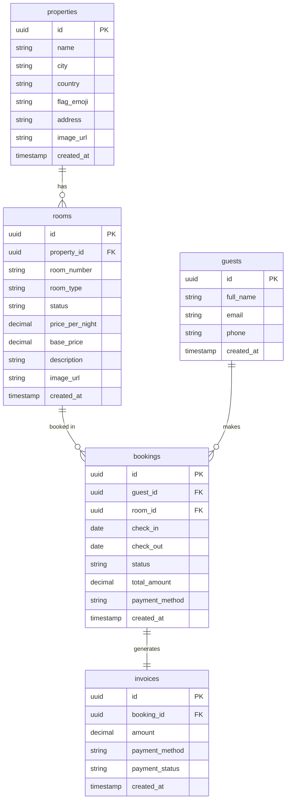

# StayWithMeh — Architecture

## System Overview

StayWithMeh is a hotel chain management system built on ASP.NET Core MVC with Supabase as the backend. A Python microservice handles AI-powered room pricing and runs independently of the main web application.



---

## Component Responsibilities

### ASP.NET Core MVC
The main web application. Controllers handle HTTP requests, pass data to Razor views via `ViewData` or strongly-typed models. All Supabase interaction happens inside controllers or a dedicated `SupabaseService` singleton.

### Supabase
Serves as the full backend-as-a-service layer:
- **PostgreSQL** — primary data store for rooms, guests, bookings, invoices
- **Auth** — handles guest registration, login, and JWT session tokens
- **Realtime** — pushes live booking status changes to connected browser clients (used for receptionist dashboard in a later sprint)
- **RLS** — enforces per-role data access rules at the database level

### Python Microservice
A standalone pricing engine that runs independently of the web app. It does not expose an HTTP API. It reads raw occupancy and seasonal data directly from the Supabase database and writes calculated prices back to the `rooms` table.

---

## AI Pricing Data Loop

The pricing engine is a scheduled overnight job, not an on-demand API hook. This is intentional — real-time pricing recalculation on every request would add latency and complexity that is not justified at this scale.

```
2:00 AM (local server time)
    ↓
Cron triggers: python pricing/run_pricing.py
    ↓
Script connects to Supabase via service_role key (bypasses RLS)
    ↓
Reads: rooms.status, bookings.check_in, bookings.check_out,
       current date, occupancy rate per branch, seasonal multipliers
    ↓
Calculates new price_per_night per room using weighted model:
    base_price × occupancy_multiplier × season_multiplier × demand_factor
    ↓
Writes updated price_per_night back to rooms table
    ↓
Web app reads the updated prices on next page load
```

**Why overnight and not on-demand:**
- Prevents price flickering within a single guest session
- Prices are stable for the full day, making them trustworthy and bookmarkable
- Reduces database write frequency significantly
- Simpler to debug — a single daily log file instead of per-request traces

**Future consideration:** An on-demand pricing endpoint may be added for the Manager Dashboard to allow manual price overrides without waiting for the nightly run.

---

## Data Isolation Rules (Supabase RLS)

Five roles are defined in the system. Each role has a distinct set of read and write permissions enforced at the database row level, not in application code. This means even if a controller bug exposes a query, the database will reject unauthorized access.

### Roles

| Role | Description |
|---|---|
| `guest` | Registered hotel guest |
| `receptionist` | Front desk staff |
| `manager` | Branch manager |
| `housekeeper` | Room cleaning staff |
| `system` | Python microservice and internal automation |

### RLS Policy Summary

#### `rooms` table
| Role | SELECT | INSERT | UPDATE | DELETE |
|---|---|---|---|---|
| `guest` | All available rooms | No | No | No |
| `receptionist` | All rooms | No | status only | No |
| `manager` | All rooms | Yes | Yes | Yes |
| `housekeeper` | Assigned rooms only | No | status only | No |
| `system` | All rooms | No | price_per_night only | No |

#### `bookings` table
| Role | SELECT | INSERT | UPDATE | DELETE |
|---|---|---|---|---|
| `guest` | Own bookings only | Yes (own) | Cancel only | No |
| `receptionist` | All bookings | Yes | Yes | No |
| `manager` | All bookings | Yes | Yes | Yes |
| `housekeeper` | No | No | No | No |
| `system` | All bookings | No | No | No |

#### `guests` table
| Role | SELECT | INSERT | UPDATE | DELETE |
|---|---|---|---|---|
| `guest` | Own record only | Via Auth | Own record | No |
| `receptionist` | All guests | Yes | Yes | No |
| `manager` | All guests | Yes | Yes | Yes |
| `housekeeper` | No | No | No | No |
| `system` | No | No | No | No |

#### `invoices` table
| Role | SELECT | INSERT | UPDATE | DELETE |
|---|---|---|---|---|
| `guest` | Own invoices only | No | No | No |
| `receptionist` | All invoices | Yes | Yes | No |
| `manager` | All invoices | Yes | Yes | Yes |
| `housekeeper` | No | No | No | No |
| `system` | No | Yes | No | No |

### Implementation Pattern

RLS policies in Supabase use the authenticated user's JWT `role` claim to filter rows. The pattern used across all tables is:

```sql
-- Example: guests can only read their own bookings
CREATE POLICY "guest_select_own_bookings"
ON bookings
FOR SELECT
USING (
    auth.jwt() ->> 'role' = 'guest'
    AND guest_id = auth.uid()
);

-- Example: system role can update price_per_night only
CREATE POLICY "system_update_room_price"
ON rooms
FOR UPDATE
USING (auth.jwt() ->> 'role' = 'system')
WITH CHECK (true);
```

The `service_role` key used by the Python microservice bypasses RLS entirely and should never be exposed to the client or committed to source control.

---

## Database Schema


